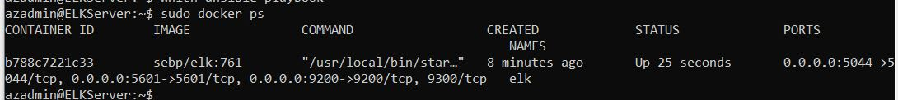

## Automated ELK Stack Deployment

The files in this repository were used to configure the network depicted below.

These files have been tested and used to generate a live ELK deployment on Azure. They can be used to either recreate the entire deployment pictured above. Alternatively, select portions of the ansible playbook file may be used to install only certain pieces of it, such as Filebeat.

  - TODO: Ansible/Roles/configvm.yaml

This document contains the following details:
- Description of the Topology
- Access Policies
- ELK Configuration
  - Beats in Use
  - Machines Being Monitored
- How to Use the Ansible Build

### Description of the Topology

The main purpose of this network is to expose a load-balanced and monitored instance of DVWA, the D*mn Vulnerable Web Application.

Load balancing ensures that the application will be highly available, in addition to restricting access to the network.
- _TODO: What aspect of security do load balancers protect? Availability. What is the advantage of a jump box?_secure access to virtual network via open SSL keys.

Integrating an ELK server allows users to easily monitor the vulnerable VMs for changes to the _file system logs____ and system _metrics____.
- _TODO: What does Filebeat watch for?_specific system logs and application logs
- _TODO: What does Metricbeat record?_Operating System performance metrics

The configuration details of each machine may be found below.
_Note: Use the [Markdown Table Generator](http://www.tablesgenerator.com/markdown_tables) to add/remove values from the table_.
| Name          | Function     | IP Address | Operation System       |
|---------------|--------------|------------|------------------------|
| Jump Box      | Gateway      | 10.0.0.4   | UbuntuServer 18.04-LTS |
| Web-1         | web server   | 10.0.0.5   | UbuntuServer 18.04-LTS |
| Web-2         | web server   | 10.0.0.6   | UbuntuServer 18.04-LTS |
| Web-3         | web server   | 10.0.0.7   | UbuntuServer 18.04-LTS |
| Load Balancer | availability | 10.0.0.8   | Azure resource         |
| ELKServer     | Monitoring   | 10.1.0.4   | UbuntuServer 18.04-LTS |

### Access Policies

The machines on the internal network are not exposed to the public Internet. 

Only the jump box virtual machine can accept connections from the Internet. Access to this machine is only allowed from the following IP addresses:
- only my local home ip

Machines within the network can only be accessed by SSH.
- _TODO: Which machine did you allow to access your ELK VM? jump box 
What was its IP address?_ 10.0.0.4

A summary of the access policies in place can be found in the table below.
| Name          | Publicly Accessible | Allowed connection to IP Addresses | Allowed connection from IP Addresses |
|---------------|---------------------|------------------------------------|--------------------------------------|
| Jump Box      | Yes (ssh)           | 10.0.0.4                           | my local ip                          |
| Web-1         | No                  | 10.1.0.4                           | 10.0.0.4, 10.1.0.4                   |
| Web-2         | No                  | 10.1.0.4                           | 10.0.0.4, 10.1.0.4                   |
| Web-3         | No                  | 10.1.0.4                           | 10.0.0.4, 10.1.0.4                   |
| Load Balancer | Yes (http)          | 10.0.0.5, 10.0.0.6, 10.0.0.7       | my local ip                          |
| ELKServer     | Yes (http)          | 10.0.0.5, 10.0.0.6, 10.0.0.7       | my local ip                          |

### Elk Configuration

Ansible was used to automate configuration of the ELK machine. No configuration was performed manually, which is advantageous because...
- _TODO: What is the main advantage of automating configuration with Ansible?_ Main advantage is changing one central configuration which changes many devices or machines or virtual machines remotely.

The playbook implements the following tasks:
- _TODO: In 3-5 bullets, explain the steps of the ELK installation play. E.g., install Docker; download image; etc._
- install docker
- install python3-pip
- install docker module from pip
- enable the docker service
- configure virtual memory
- download and launch the elk docker_container

The following screenshot displays the result of running `docker ps` after successfully configuring the ELK instance.

### Target Machines & Beats
This ELK server is configured to monitor the following machines:
- _TODO: 10.0.0.5, 10.0.0.6, 10.0.0.7

We have installed the following Beats on these machines:
- _TODO: Filebeat and Metricbeat

These Beats allow us to collect the following information from each machine:
- _TODO: In 1-2 sentences, explain what kind of data each beat collects, and provide 1 example of what you expect to see. E.g., `Winlogbeat` collects Windows logs, which we use to track user logon events, etc._
Filebeat monitors specific logs files for system and services.
Metricbeat monitors system performance info.

### Using the Playbook
In order to use the playbook, you will need to have an Ansible control node already configured. Assuming you have such a control node provisioned: 

SSH into the control node and follow the steps below:
- Copy the filebeat-config.yml metricbeat-config.yml file to /etc/ansible/files .
- Update the filebeat-config.yml and metricbeat-config.yml file to include the IP address and port for elasticsearch and kibana. Update the filebeat-playbook.yml and metricbeat-playbook.yml to have the /etc/ansible/files for the paths for filebeat-config.yml and metricbeat-config.yml.
- Run the playbook, and navigate to kibana filebeat syslog overview and kibana metricbeat docker overview to check that the installation worked as expected.

_TODO: Answer the following questions to fill in the blanks:_
- _Which file is the playbook? filebeat-playbook.yml metricbeat-playbook.yml Where do you copy it?_/etc/ansible/files on the jumpbox on the Web-1 Web-2 and Web-3 DVMAs.
- _Which file do you update to make Ansible run the playbook on a specific machine? /etc/ansible/hosts  How do I specify which machine to install the ELK server on versus which to install Filebeat on?_
ELK server, /etc/ansible/roles/install-elk.yaml, modify value after "hosts:".
Filebeat, /etc/ansible/files/filebeat-playbook.yml, modify value after"hosts:"
- _Which URL do you navigate to in order to check that the ELK server is running?
http://10.1.0.4:5601

_As a **Bonus**, provide the specific commands the user will need to run to download the playbook, update the files, etc._